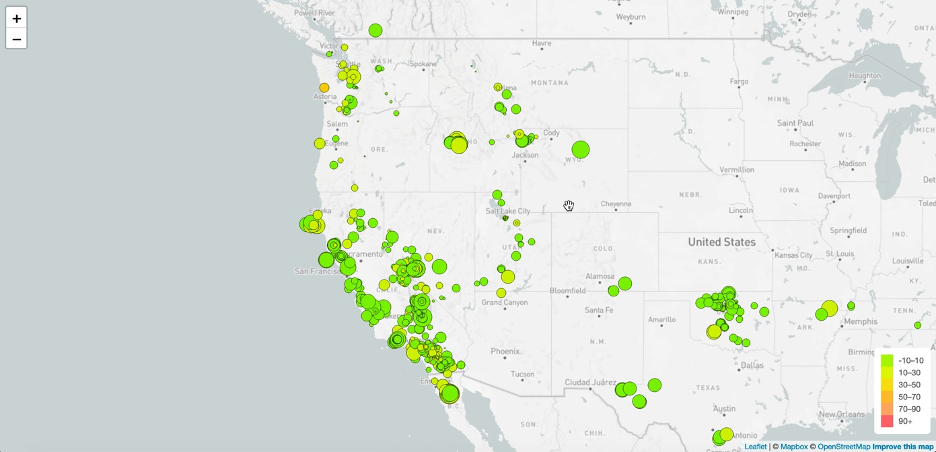
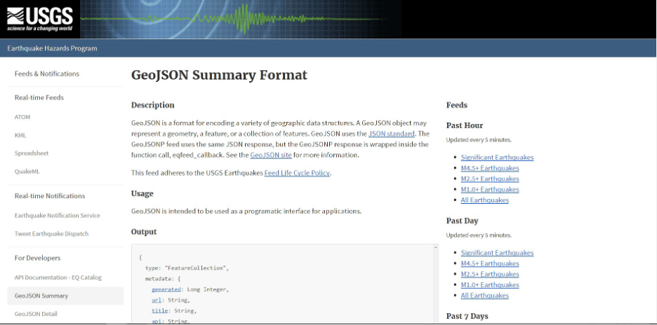
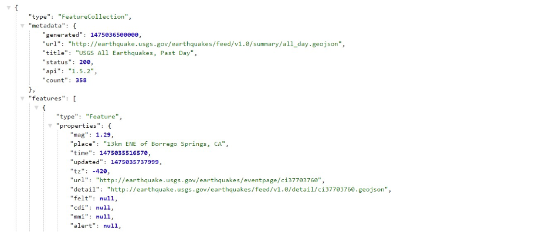
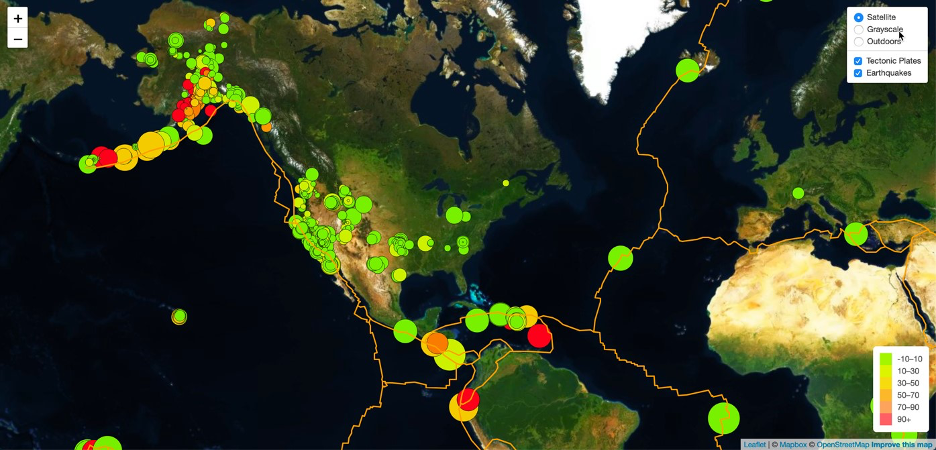

# leaflet-challenge

## Background
The United States Geological Survey, or USGS for short, is responsible for providing scientific data about natural hazards, the health of our ecosystems and environment, and the impacts of climate and land-use change. Their scientists develop new methods and tools to supply timely, relevant, and useful information about the Earth and its processes.   
The USGS is interested in building a new set of tools that will allow them to visualize their earthquake data. They collect a massive amount of data from all over the world each day, but they lack a meaningful way of displaying it. In this challenge, you have been tasked with developing a way to visualize USGS data that will allow them to better educate the public and other government organizations (and hopefully secure more funding) on issues facing our planet. 
## Before You Begin
Create a new repository for this project called leaflet-challenge. Do not add this Challenge to an existing repository.  
Clone the new repository to your computer.  
Inside your local git repository, create a directory for the Leaflet challenge. Use the folder names to correspond to the challenges: Leaflet-Part-1 and Leaflet-Part-2. 
This Challenge uses both HTML and JavaScript, so be sure to add all the necessary ## files.  
These will be the main files to run for analysis.  
Push the above changes to GitHub. 
## Files
Download the following files to help you get started:  
Module 15 Challenge files Links to an external site. 
## Instructions
The instructions for this activity are broken into two parts:  
Part 1: Create the Earthquake Visualization  
Part 2: Gather and Plot More Data (Optional with no extra points earning) 
## Part 1: Create the Earthquake Visualization

Your first task is to visualize an earthquake dataset. Complete the following steps:  
Get your dataset. To do so, follow these steps:  
The USGS provides earthquake data in a number of different formats, updated every 5 minutes. Visit the USGS GeoJSON Feed page and choose a dataset to visualize. The following image is an example screenshot of what appears when you visit this link: 

When you click a dataset (such as "All Earthquakes from the Past 7 Days"), you will be given a JSON representation of that data. Use the URL of this JSON to pull in the data for the visualization. The following image is a sampling of earthquake data in JSON format: 

Import and visualize the data by doing the following:  
Using Leaflet, create a map that plots all the earthquakes from your dataset based on their longitude and latitude.  
Your data markers should reflect the magnitude of the earthquake by their size and the depth of the earthquake by color. Earthquakes with higher magnitudes should appear larger, and earthquakes with greater depth should appear darker in color.   
Hint: The depth of the earth can be found as the third coordinate for each earthquake. Include popups that provide additional information about the earthquake when its associated marker is clicked.  
Create a legend that will provide context for your map data.  
Your visualization should look something like the preceding map. 
## Part 2: Gather and Plot More Data (Optional with no extra points earning)
Plot a second dataset on your map to illustrate the relationship between tectonic plates and seismic activity. You will need to pull in this dataset and visualize it alongside your original data.  
Data on tectonic plates can be found at https://github.com/fraxen/tectonicplates  
This part is completely optional; you can complete this part as a way to challenge yourself and boost your new skills.  
The following image is an example screenshot of what you should produce: 

Perform the following tasks:  
Plot the tectonic plates dataset on the map in addition to the earthquakes.  
Add other base maps to choose from.  
Put each dataset into separate overlays that can be turned on and off independently. Add layer controls to your map. 
## Requirements
These requirements apply only to "Part 1: Create the Earthquake Visualization" as "Part 2" is optional with no extra points earning. 
#### Map (60 points) 
TileLayer loads without error (20 points)  
Connects to geojson API using D3 without error (20 points)  
Markers with size corresponding to earthquake magnitude (10 points)  
A legend showing the depth and their corresponding color (10 points) 
#### Data Points (40 points) 
Data points scale with magnitude level (10 points)  
Data points colors change with depth level (10 points)  
Each point has a tooltip with the Magnitude, the location and depth (10 points)  
All data points load in the correct locations (10 points) 
